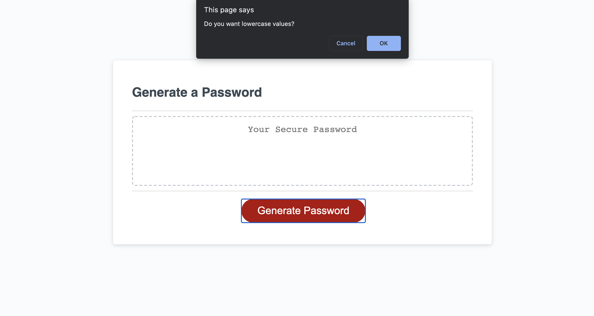

# Challenge03-JavaScript-Password-Generator

Class: UCB-VIRT-BO-FSF-PT-03-2021-U-B-MW

Challenge: Challenge-03 JavaScript Password Generator

## Purpose

This code repository is a deployment of existing HTML/ CSS to show a Password Generator button, and a box above it. The purpose of our program is to prompt the user for various criteria to choose a password, and then generate a password for that particular user, and display it in the box.

## Built With
* HTML
* CSS
* JavaScript

## Contribution
Made by Stefan Hall

### 2021 Challenge-03 JavaScript Password

Link to Deployed Application: https://surferstef.github.io/Challenge03-Javascript-Password-Generator/

## Screenshot
